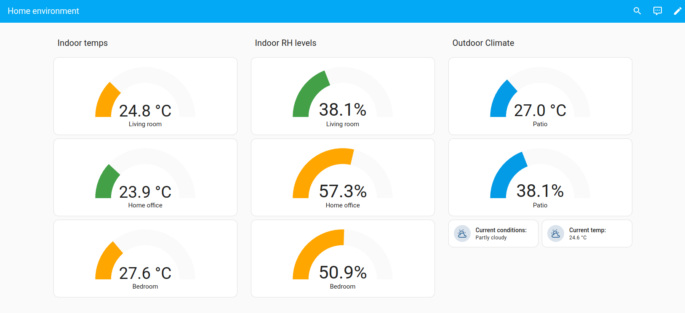

# Indoor Climate Monitoring Dashboard


## Screenshot





## YAML:

```yaml
views:
  - title: Current Data
    cards: []
    type: sections
    sections:
      - type: grid
        cards:
          - type: gauge
            entity: sensor.living_room_t_h_sensor_temperature
            name: Living room
            severity:
              green: 0
              yellow: 24
              red: 30
          - type: gauge
            entity: sensor.office_t_h_temperature
            name: Home office
            severity:
              green: 0
              yellow: 24
              red: 30
          - type: gauge
            entity: sensor.bedroom_t_h_temperature
            name: Bedroom
            needle: false
            severity:
              green: 0
              yellow: 24
              red: 30
        title: Indoor temps
      - type: grid
        cards:
          - type: gauge
            entity: sensor.temperature_humidity_sensor_humidity
            name: Living room
            severity:
              green: 0
              yellow: 50
              red: 60
          - type: gauge
            entity: sensor.office_t_h_humidity
            name: Home office
            severity:
              green: 0
              yellow: 50
              red: 60
          - type: gauge
            entity: sensor.bedroom_t_h_humidity
            name: Bedroom
            severity:
              green: 0
              yellow: 50
              red: 60
        title: Indoor RH levels
      - type: grid
        cards:
          - type: gauge
            entity: sensor.temperature_humidity_sensor_temperature
            name: Patio
          - type: gauge
            entity: sensor.temperature_humidity_sensor_humidity
            name: Patio
          - type: tile
            entity: weather.ims_weather
            state_content: state
            name: 'Current conditions:'
          - type: tile
            entity: weather.ims_weather
            state_content: temperature
            name: 'Current temp:'
        title: Outdoor Climate
    icon: mdi:home
title: Home environment

```

